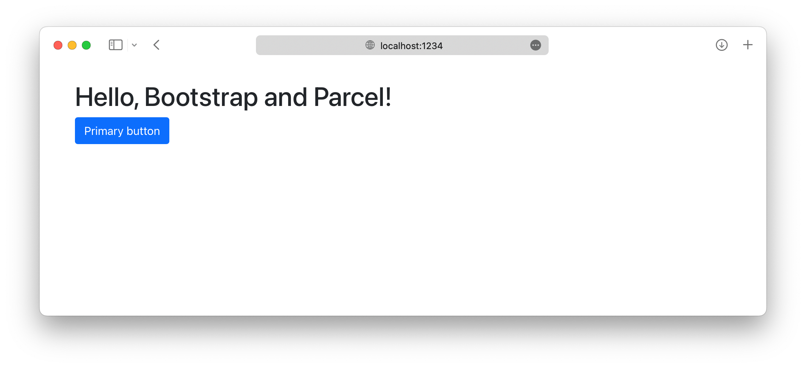

# Bootstrap + Parcel

## Dependencias

1. Crear o directorio do proxecto
```bash
mkdir my-project && cd my-project
npm init -y
```

2. Instalar Parcel como dependencia de desenvolvemento
```bash
npm i --save-dev parcel
```


3. Instalar Bootstrap
```bash
npm i --save bootstrap @popperjs/core
```

## Estrutura do proxecto

4. Crear os cartafoles de orixe `src`: 
```bash
mkdir {src,src/js,src/scss}
```
5. Crear os arquivos de orixe - folla de estilo e arquivo js para completar a estrutura do proxecto:
```bash
touch src/index.html src/js/main.js src/scss/styles.scss
```


Parcel necesita unha páxina HTML e un script npm para iniciar o servidor de desenvolvemento.

&rarr; `index.html`

```html
<!doctype html>
<html lang="en">
  <head>
    <meta charset="utf-8">
    <meta name="viewport" content="width=device-width, initial-scale=1">
    <title>Bootstrap w/ Parcel</title>
    <link rel="stylesheet" href="scss/styles.scss">
    <script type="module" src="js/main.js"></script>
  </head>
  <body>
    <div class="container py-4 px-3 mx-auto">
      <h1>Hello, Bootstrap and Parcel!</h1>
      <button class="btn btn-primary">Primary button</button>
    </div>
  </body>
</html>
```

Incluímos un pouco de estilo Bootstrap: `div class="container"` e `<button>` para verificar cando Parcel carga o CSS de Bootstrap.

Parcel detectará automaticamente que estamos a usar Sass e instalará o complemento Sass Parcel para admitilo. Non obstante, se queres, tamén podes executar manualmente ``npm i --save-dev @parcel/transformer-sass``.

**Scripts de Parcel**: no ``package.json`` do proxecto incluír un script `"start"` no obxecto ``"scripts"`` para iniciar o servidor de desenvolvemento de Parcel e renderizar o arquivo HTML que creamos, despois de compilalo no directorio ``dist``.

```json
{
   // ...
   "scripts": {
     "start": "parcel serve src/index.html --public-url / --dist-dir dist",
     "test": "echo \"Error: no test specified\" && exit 1"
   },
   // ...
}
```

:eye: **PostCSS** trae con el a **Autoprefixer**. E **Parcel** trae con el a **PostCSS**.

POLO TANTO O ÚNECO PAQUETE QUE NECESITAS NO `package.json` DO PROXECTO É **PARCEL**!

Engadir a máis estes paquetes por separado pode causar problemas inesperados.

## Comezar con Parcel. 

```bash
npm start
```

## Importar Bootstrap

Importar Bootstrap a Parcel require dúas importacións, unha no `styles.scss` e outra no ``mainjs``.

1. **Importar o CSS de Bootstrap**. Importar toda a fonte Sass de Bootstrap en ``src/scss/styles.scss``:

```scss
// Import all of Bootstraps CSS
@import "~bootstrap/scss/bootstrap";
```
Tamén podes importar as follas de estilo individualmente se queres. 

```scss
// Anular as variables predeterminadas de Sass de Bootstrap
//
// Case todas as variables en Bootstrap están escritas coa marca `!default`.
// Este documento SCSS permíte anular os valores predeterminados desas variables
// antes importa os arquivos Sass de orixe de Bootstrap.
//
// Anular os valores predeterminados das variables é a mellor forma de personalizar o teu
// CSS sen escribir _novos_ estilos. Por exemplo, podes cambiar
// `$body-color` ou escribir máis CSS que anule o CSS de Bootstrap declarando
//  novas clases ou empregando elementos html:
// `body { color: red; }`.

// aínda así precisaras certos elementos

@import "~bootstrap/scss/functions";

//
// Bring in Bootstrap
//

// Opcion 1
//
// Importar todo Bootstrap's CSS

// @import "~bootstrap/scss/bootstrap";

// Opcion 2

// Coloca primeiro as substitucións de variables 
// e despois importa só os estilos que necesites. 
// Ter en conta que algunhas follas de estilo son necesarias pase o que pase.

// Altera as opcións globais
// revisa adocumentación para saber que opcións podes modificar

$enable-gradients: true;
$enable-shadows: true;

$offcanvas-box-shadow: 0 1rem 3rem rgba(0, 0, 0, .175);

// Personaliza algúns valores predeterminados

$body-color: #333;
$body-bg: #fff;
$border-radius: .4rem;
$success: #7952b3;

$border-radius: 0rem;

// Requirido

@import "~bootstrap/scss/variables";
@import "~bootstrap/scss/maps";
@import "~bootstrap/scss/mixins";
@import "~bootstrap/scss/utilities";
@import "~bootstrap/scss/root";
@import "~bootstrap/scss/reboot";

@import "~bootstrap/scss/type";
// @import "~bootstrap/scss/images";
@import "~bootstrap/scss/containers";
@import "~bootstrap/scss/grid";
// @import "~bootstrap/scss/tables";
@import "~bootstrap/scss/forms";
@import "~bootstrap/scss/buttons";
@import "~bootstrap/scss/transitions";
@import "~bootstrap/scss/dropdown";
// @import "~bootstrap/scss/button-group";
@import "~bootstrap/scss/nav";
@import "~bootstrap/scss/navbar"; // Requires nav
@import "~bootstrap/scss/card";
// @import "~bootstrap/scss/breadcrumb";
// @import "~bootstrap/scss/accordion";
// @import "~bootstrap/scss/pagination";
// @import "~bootstrap/scss/badge";
// @import "~bootstrap/scss/alert";
// @import "~bootstrap/scss/progress";
// @import "~bootstrap/scss/list-group";
@import "~bootstrap/scss/close";
// @import "~bootstrap/scss/toasts";
@import "~bootstrap/scss/modal"; // Requires transitions
// @import "~bootstrap/scss/tooltip";
@import "~bootstrap/scss/popover";
// @import "~bootstrap/scss/carousel";
// @import "~bootstrap/scss/spinners";
@import "~bootstrap/scss/offcanvas"; // Requires transitions
// @import "~bootstrap/scss/placeholders";

// Helpers
// @import "helpers";

// Utilities
@import "~bootstrap/scss/utilities/api";


//
// Custom styles
//

// @import "icon-list";

body {
  padding: inherit;
}

```


2. **Importar JS de Bootstrap**. importar todos os JS de Bootstrap a ``src/js/main.js``. Popper importarase automaticamente a través de Bootstrap.

```js
// Import all of Bootstrap's JS
import * as bootstrap from 'bootstrap'
```

Tamén se poden importar os complementos de JavaScript individualmente segundo sexa necesario e así reducir o tamaño dos paquetes:

```js
import Alert from 'bootstrap/js/dist/alert'

// or, specify which plugins you need:
import { Tooltip, Toast, Popover } from 'bootstrap'
```

E xa está! 🎉 Co Sass e JS de orixe de Bootstrap cargados, o teu servidor de desenvolvemento local debería verse así:



https://getbootstrap.com/docs/5.2/customize/sass/

[GitHub - buscaroli/bootstrap5-and-parcel: Learning Bootstrap 5, how to customise its classes and how to work with it using the Parcel Bundler.](https://github.com/buscaroli/bootstrap5-and-parcel)